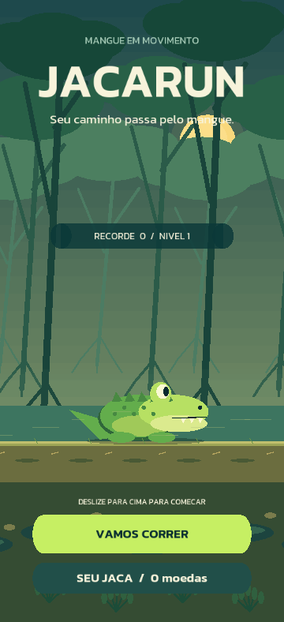

# JACARUN

**Corra. Coma. Compita.**

Consulte o [cronograma de produção e monetização](CRONOGRAMA_PRODUCAO.md) para as etapas de Android, iOS, publicação nas lojas e integração com AdMob.

JacaRun é um **endless runner 2D em desenvolvimento**, pensado para celulares em orientação vertical. Um jacaré corre pelo mangue, supera obstáculos, captura alimentos e coleta moedas para personalizar sua aparência.

Este repositório contém um **protótipo visual em C++/Axmol**, com corrida em tempo real, mangue em tela cheia, controles por gestos, cenário provisório, loja, pausa, save e reinício. A interface de terminal continua disponível e compartilha as mesmas regras. A versão 0.4 destaca a ação mais perto do centro da tela e traz sequências progressivas de obstáculos. Os vídeos Android orientaram os ajustes; esta revisão ainda precisa de reteste físico.



## Jogar a versão visual no Windows

Requisitos: Git e Visual Studio 2022/2026 com desenvolvimento desktop C++ e CMake. O primeiro build baixa o Axmol **2.11.4**, fixado por commit, e suas dependências.

```powershell
powershell -NoProfile -ExecutionPolicy Bypass -File .\build-visual.ps1 -Run
```

- **Pular:** arraste para cima em qualquer ponto da corrida.
- **Deslizar:** arraste para baixo. O gesto responde durante o movimento do dedo.
- **Pausar:** toque rápido com dois dedos. Para retomar, arraste para cima na tela de pausa.
- **Computador:** Espaço/seta para cima pula; seta para baixo desliza; P/Esc pausa. Enter inicia/reinicia ou retoma.
- **Loja:** SEU JACA no menu; acessórios usam apenas moedas coletadas no jogo.

O executável fica em `visual/build-win32/bin/JacaRun/Debug/JacaRun.exe`. No Windows, o save visual fica em `%LOCALAPPDATA%/JacaRun/jacarun.save`; ele é separado do save do terminal. Sair para o menu ou perder contabiliza a corrida. Ir para segundo plano pausa; uma corrida interrompida pelo encerramento do processo não é restaurada.

Para reproduzir a validação automática da interface:

```powershell
powershell -NoProfile -ExecutionPolicy Bypass -File .\build-visual.ps1 -Smoke
```

O teste usa perfil isolado, envia eventos de gesto e verifica coleta, permanência dos objetos ultrapassados, pausa com dois dedos, save e reinício. Use também `-Aspect Tall` para testar a proporção 360 × 788 do vídeo de referência. As capturas e o relatório ficam em `output/visual-smoke-DATA-HORA/`. Consulte [o guia técnico visual](visual/README.md) para Android, iOS, limitações e licenças.

**APK atual:** `output/JacaRun-0.4.0-debug.apk`. Transfira ao celular e instale como atualização da 0.3; o identificador e o formato do save foram preservados. Não é uma versão de loja.

### Ritmo da corrida

O percurso começa com raízes e galhos isolados. Após 180 m surgem duplas; após 550 m, combinações de três ações, incluindo saltos seguidos e alternância entre pulo e deslize. Seis padrões evitam repetir imediatamente a mesma sequência. A densidade cresce até 1.800 m, com trechos de recompensa entre combinações e moedas indicando a altura da ação. O HUD mostra cinco faixas de ritmo.

A velocidade continua limitada a 24 m/s. Os obstáculos mantêm pelo menos 1,35 s de separação nessa velocidade, permitindo terminar pulo ou deslize antes da próxima ação. Cada nova corrida recomeça suavemente, independentemente do nível salvo do perfil. Esses valores são experimentais e precisam de teste humano.

## Decisões confirmadas no GDD

| Aspecto | Definição |
| --- | --- |
| Plataforma e orientação | Mobile, vertical |
| Gênero e visual | Endless runner, primeira versão em 2D |
| Linguagem | C++ |
| Personagem e cenário inicial | Jacaré no mangue |
| Movimento | Corrida automática |
| Pontuação | Pontos por desempenho, com bônus por alimentos |
| Moedas | Coleta durante a corrida e uso na personalização |
| Loja | Acessórios |

A identidade proposta é brasileira, tropical, cartoon e bem-humorada. O GDD também descreve competição semanal e progressão de longo prazo.

**Os valores, preços, tipos de power-ups e regras detalhadas abaixo são decisões experimentais deste protótipo.** Eles não substituem a aprovação e o balanceamento das seções ainda abertas no GDD.

## Compilar e jogar no terminal

Para a interface de terminal, é necessário um compilador com suporte a **C++17**. O núcleo não depende da engine; no Windows, o salvamento usa também a API do sistema para substituir o arquivo com segurança.

Na raiz do projeto, usando PowerShell com `g++` disponível no `PATH`:

```powershell
powershell -NoProfile -ExecutionPolicy Bypass -File .\build.ps1
.\output\jacarun.exe
```

A opção de execução de scripts vale apenas para esse processo do PowerShell. Como alternativa, compile diretamente:

```powershell
g++ -std=c++17 -Wall -Wextra -Wpedantic -Iinclude main.cpp src/GameManager.cpp src/Player.cpp src/Level.cpp src/Profile.cpp -o output/jacarun.exe
.\output\jacarun.exe
```

O executável atualizado é **`output/jacarun.exe`**. O antigo `output/main.exe`, já versionado no projeto, não é atualizado pelo script.

Para assistir a uma corrida automática de demonstração:

```powershell
.\output\jacarun.exe --demo --seed 42
```

A demonstração não lê nem grava o progresso do jogador. A seed permite repetir o mesmo percurso.

## Controles do terminal

Digite o comando e pressione Enter.

| Onde | Comando | Ação |
| --- | --- | --- |
| Menu ou fim de partida | `jogar` ou `j` | Inicia uma nova corrida |
| Menu ou fim de partida | `loja` | Mostra saldo, acessórios e IDs |
| Menu ou fim de partida | `comprar ID` | Compra um acessório |
| Menu ou fim de partida | `equipar ID` | Equipa um acessório adquirido |
| Corrida | Enter ou `correr` | Avança a corrida por 0,2 segundo |
| Corrida | `pular` ou `p` | Tenta pular e avança 0,2 segundo |
| Corrida | `agachar` ou `a` | Tenta deslizar e avança 0,2 segundo |
| Corrida ou pausa | `pausa` | Pausa ou retoma a partida |
| Qualquer tela | `menu` | Encerra a corrida, contabiliza recompensas e volta ao menu |
| Qualquer tela | `ajuda` | Exibe os comandos |
| Qualquer tela | `sair` | Encerra a corrida, salva e sai |

Pulo e deslize precisam aguardar o fim da ação anterior. Tentar uma ação indisponível ainda consome o turno. Comandos desconhecidos não avançam o tempo.

O painel informa distância, velocidade, pontuação, moedas, combo, altura do personagem, efeitos ativos e os próximos objetos. Use o tempo estimado até o obstáculo para reagir: iniciar um pulo ou deslize cerca de **0,3 segundo antes** da chegada é uma referência útil com o balanceamento atual.

## Mecânicas implementadas

### Corrida e dificuldade

A distância resulta da velocidade multiplicada pelo tempo simulado. A velocidade começa em **10 m/s**, aumenta com a distância e tem limite de **24 m/s**.

O percurso é gerado continuamente à frente do personagem. Os encontros ficam mais próximos conforme a corrida avança, respeitando um espaçamento mínimo. Objetos já atravessados são removidos, mantendo o tamanho do cenário em memória limitado.

A simulação divide cada atualização em passos de até **1/120 segundo**. As colisões consideram os objetos cruzados no deslocamento, inclusive quando o personagem ultrapassa a posição de um obstáculo entre duas atualizações.

### Pulo, deslize e obstáculos

- **Raiz:** exige altura de pelo menos 0,7 unidade no momento do encontro.
- **Galho:** exige estar no chão e deslizando.
- **Pulo:** só começa no chão, fora de um deslize; não há pulo duplo.
- **Deslize:** dura 0,9 segundo e não pode começar no ar nem ser renovado enquanto está ativo.
- **Colisão:** encerra a corrida, exceto quando um escudo ativo absorve a batida.

A gravidade e o movimento vertical usam tempo decorrido. A pausa congela movimento, combo, efeitos e geração do percurso.

### Alimentos, combos e recordes

| Alimento | Pontos base | Posição no percurso |
| --- | ---: | --- |
| Caranguejo | 20 | Baixo |
| Peixe | 30 | No ar, junto a raízes |
| Peixe raro | 100 | No chão, em algumas recompensas entre sequências |

A coleta considera a altura do personagem. Alimentos fora do alcance são perdidos.

Cada alimento capturado aumenta a sequência do combo. A cada três alimentos, o multiplicador sobe um nível, até **x5**. Ele vale para os pontos dos alimentos. A sequência termina ao perder um alimento, ficar oito segundos sem capturar outro ou sofrer uma colisão absorvida pelo escudo.

**Pontuação = parte inteira da distância percorrida + pontos dos alimentos com multiplicador.**

Os recordes de pontuação e distância são atualizados ao encerrar a corrida.

### Moedas, loja e personalização

Moedas coletadas ficam no saldo da corrida e são creditadas na carteira quando ela termina, inclusive ao voltar ao menu ou sair. Cada corrida credita suas recompensas apenas uma vez.

| ID | Acessório | Preço |
| --- | --- | ---: |
| 0 | Jaca original | Gratuito, já adquirido |
| 1 | Boné do mangue | 15 moedas |
| 2 | Óculos tropicais | 35 moedas |
| 3 | Chapéu de pescador | 60 moedas |

O jogo bloqueia compras repetidas, saldo insuficiente e equipamentos não adquiridos. Os acessórios são cosméticos: nesta versão, o item equipado aparece pelo nome no painel do perfil e não altera a física ou a pontuação.

### Power-ups experimentais

- **Escudo:** protege de uma colisão e é consumido ao absorvê-la; expira após 12 segundos se não for utilizado.
- **Ímã:** durante 10 segundos, permite coletar moedas em qualquer altura quando elas cruzam o personagem.

Os efeitos são encontrados no percurso. Recolher o mesmo tipo renova sua duração. Ambos são removidos ao iniciar uma nova corrida.

### Experiência e níveis

Cada corrida concede:

- 1 XP a cada 10 metros completos;
- 3 XP por alimento capturado;
- 5 XP por obstáculo superado sem depender de escudo.

O jogador ganha um nível a cada **200 XP**. Os níveis registram a progressão local; ainda não desbloqueiam biomas ou missões.

## Salvamento

O perfil é salvo automaticamente ao encerrar a corrida, comprar ou equipar um acessório, voltar ao menu e sair. Ele inclui carteira, XP, recordes, acessórios adquiridos e equipamento atual.

O caminho padrão é `output/jacarun.save`, relativo à pasta de execução. Os arquivos de progresso e os novos executáveis são ignorados pelo Git.

```powershell
# Jogar sem ler nem gravar progresso
.\output\jacarun.exe --no-save

# Usar outro perfil e um percurso reproduzível
.\output\jacarun.exe --save output/outro-perfil.save --seed 42
```

A gravação usa um arquivo temporário antes de substituir o save anterior. Arquivos inválidos ou incompatíveis interrompem o carregamento e são preservados; nesse caso, é possível jogar com `--no-save` ou escolher outro caminho. Erros de gravação são exibidos no terminal.

A partida em andamento não é restaurada após fechar o programa. O salvamento é local e não possui sincronização online.

## Testes

```powershell
powershell -NoProfile -ExecutionPolicy Bypass -File .\build.ps1 -Test
```

A suíte verifica física, restrições das ações, colisões, consumo único de objetos, pontuação, combos, coleta por altura, power-ups, pausa, reinício, recompensas, compras e salvamento. Também executa **100 percursos com seeds diferentes**, alcançando a velocidade máxima, para verificar que as sequências geradas podem ser atravessadas.

## Estrutura do projeto

```text
.
├── main.cpp                  # Interface do terminal, comandos e demonstracao
├── build.ps1                 # Compilacao do jogo e testes
├── build-visual.ps1          # Protótipo Axmol no Windows e teste visual
├── build-android.ps1         # APK Android de desenvolvimento
├── CMakeLists.txt            # Núcleo, terminal e testes sem a engine
├── visual/                   # Cena Axmol e adaptadores de plataforma
├── include/
│   ├── Balance.h             # Parametros de fisica, dificuldade e recompensas
│   ├── GameManager.h         # Estados e regras da partida
│   ├── Level.h               # Objetos e geracao do percurso
│   ├── Player.h              # Pulo e deslize
│   └── Profile.h             # Progresso e acessorios
├── src/
│   ├── GameManager.cpp       # Colisoes, coleta, combos e recompensas
│   ├── Level.cpp             # Geracao procedural e objetos atravessados
│   ├── Player.cpp            # Fisica por tempo decorrido
│   └── Profile.cpp           # Catalogo, compras e persistencia
├── tests/
│   └── mechanics_tests.cpp   # Testes automatizados
└── output/                   # Executaveis e saves locais
```

Os principais parâmetros estão em `include/Balance.h`; os acessórios e seus preços estão no catálogo de `src/Profile.cpp`.

## Etapas ainda abertas

O ciclo local do protótipo está implementado. A visão completa do GDD ainda depende de:

- Arte e animações finais, áudio, tutorial e acessibilidade.
- Validação da interface/toque em aparelhos Android/iOS e builds para as lojas.
- Ranking online semanal, contas, validação de pontuações e recompensas competitivas.
- Novos biomas, fases, missões, conquistas e regras de desbloqueio.
- Balanceamento final, monetização e fechamento do escopo da versão 1.0.

## Referência

Baseado no **JACARUN — Game Design Document, versão 0.1**, com status **Em planejamento**, e no código deste repositório. As decisões aprovadas estão registradas na seção **22. Decisões fechadas** do GDD. As regras experimentais documentadas acima servem para testar o jogo enquanto os detalhes de design são consolidados.
