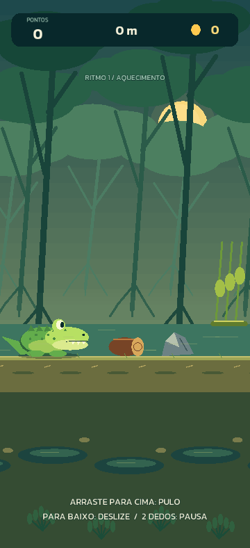
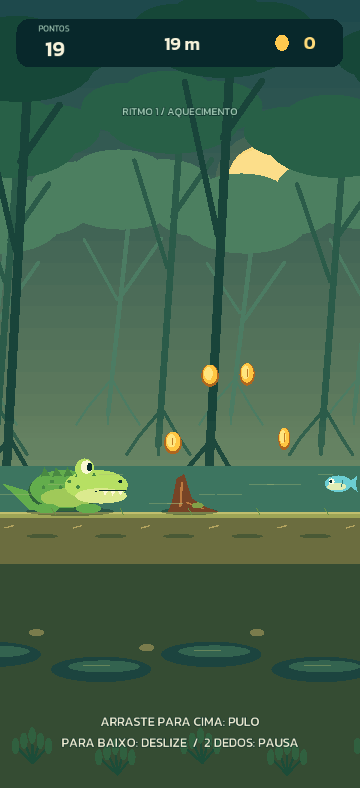
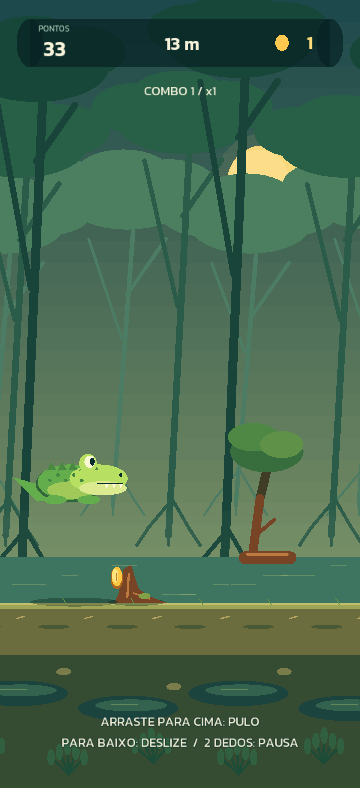

# Registro de validação — protótipo visual

## Revisão 0.6 — novos obstáculos e modo Insano

Troncos caídos e pedras exigem salto; cipós baixos exigem deslize. Os novos desenhos entram depois de 300 m. A pontuação aumenta a velocidade em até 36 m/s sobre a base por distância (máximo de 24 m/s), atingindo o teto de 60 m/s aos 100 mil pontos quando a base já está completa. Ações mantêm a distância percorrida da 0.5, sem alongar a trajetória ao aumentar esse teto.

A partir de 5 mil pontos as sequências têm pelo menos três obstáculos; aos 20/40/60/80/100 mil, chegam a quatro/cinco/seis/sete/oito. O intervalo chega a 30 m, ou 0,5 s a 60 m/s. O trecho após um power-up preserva espaço adicional. A nova pressão só afeta trechos ainda não gerados; entidades existentes não mudam de posição. Ao reiniciar, pontuação e velocidade voltam ao início.

**Testes:** 18/18 grupos do núcleo e 3/3 de apresentação aprovados. Além dos 100 percursos normais, 20 seeds rodaram por 120 s acima de 100 mil pontos, superando mais de 200 obstáculos por corrida sem derrota nem absorção por escudo. O teste usa alimentos adicionados como preparação para alcançar a pontuação, sem modificar o jogo entregue. Arcos e distância das ações foram verificados também a 40/60 m/s. Os três novos tipos foram testados com ação correta e com colisão; geração extrema manteve espaçamento de coletáveis e memória limitada.

Prova visual aprovada na proporção 360 × 788 em `output/visual-smoke-20260924-134612`, com regressão de gestos, coleta, passagem, pausa/save/reinício e inspeção dos novos desenhos. A captura de catálogo abaixo é uma montagem para inspeção de arte, não uma sequência procedural jogável.

**APK:** `output/JacaRun-0.6.0-debug.apk`, versionCode 6, 24.010.889 bytes. Certificado original de atualização verificado; alinhamento ZIP de 16 KB aprovado. SHA-256: `2849e59ce5c96f001de78a4a4b23e8de385372c7c17a9dae4cfccd6f33c072b4`.

Pendente: instalação e avaliação humana no S24+, especialmente legibilidade e reação no modo Insano. Possibilidade mecânica não significa que a dificuldade final já esteja balanceada.

## Revisão 0.5 — moedas, duração das ações e painel

O vídeo mais recente tem aproximadamente 19 s. A inspeção dos quadros e da captura enviada confirmou moedas e alimentos na mesma posição e faixas escuras nas junções do painel. O código também usava duração fixa de ação, cobrindo menos distância quando o jogo estava lento.

- Coletáveis separados por pelo menos 5,5 m, inclusive entre combinações; comida após a passagem, sem disputar a posição das moedas.
- Arco de quatro moedas amostrado da parábola real para um salto iniciado 6 m antes da raiz. Moedas dos galhos ficam mais baixas; alimento e power-up têm posições separadas.
- Física de pulo/deslize parametrizada pela distância: salto de aproximadamente 20,7 m e deslize de 21,6 m. A 10 m/s, as ações duram aproximadamente 2,07/2,16 s; a 24 m/s, 0,86/0,9 s. A aceleração continua gradual e a altura máxima foi preservada.
- Desenhos de obstáculos alinhados ao ponto de encontro, com margem visual para finalizar as ações. Colisão ainda é resolvida uma única vez pelo núcleo.
- Painéis arredondados formam uma única superfície; o painel de pontuação é opaco, eliminando tanto sobreposição de transparências quanto árvores aparecendo através dele.

**Verificação:** 17/17 grupos de mecânicas e 3/3 de apresentação aprovados. Inclui 100 corridas de mais de 4 km, espaçamento de coletáveis em 100 percursos de 6 km, mesma trajetória a 10/17/24 m/s e coleta de todo o arco. Smoke visual final aprovado em 432 × 810 (`output/visual-smoke-20260924-131050`) e 360 × 788 (`output/visual-smoke-20260924-131111`), com capturas extras de arco e de passagem em pulo/deslize conferidas.

**APK:** `output/JacaRun-0.5.0-debug.apk`, versionCode 5, 24.010.893 bytes. Assinatura verificada e certificado idêntico ao da 0.3/0.4.1; alinhamento ZIP de 16 KB aprovado. SHA-256: `0d41a9070f1d154ce7684713171213316e0d9685801dbb2bd363a32039a1d93a`.

Pendente: testar instalação, conforto dos novos tempos de ação e sessão de 15 minutos no Samsung S24+. A simulação e as capturas não substituem esse teste humano.

## Correção 0.4.1 — assinatura de atualização

O usuário relatou “app não instalado” no Samsung S24+. A comparação dos APKs locais encontrou certificados diferentes: 0.3 com SHA-256 `345dc05f4830fdaa39d1d0de1ca2a4628755ff8728a9d9c4674e938b3d64c774` e 0.4.0 com `796f7fbb01e206c87235fe2cf348aeb05ca4cb4028d6aeb925b00e4a9caad795`. A assinatura válida registrada abaixo para a 0.4.0 não garantia atualização da 0.3. Não havia aparelho conectado via ADB para consultar o erro de instalação.

A 0.4.1/versionCode 4 restaura o certificado da 0.3. A chave original foi preservada em `.deps/signing/debug.keystore`, ignorada pelo Git; o Gradle usa esse caminho explicitamente. O helper verifica a assinatura e a impressão do certificado antes de entregar os APKs em `output`. Isso evita que uma mudança do usuário efetivo do Gradle altere silenciosamente a chave.

APK corrigido: `output/JacaRun-0.4.1-debug.apk`. Certificado comparado com a 0.3 e alinhamento ZIP de 16 KB aprovado. A confirmação de instalação por cima da versão anterior e de preservação do save no S24+ continua pendente. Não orientar desinstalação como primeira solução.

## Revisão 0.4 — enquadramento e percurso progressivo

Em 24/09/2026, o segundo vídeo Android (aproximadamente 54 s, até 692 m) orientou esta revisão. Os quadros mostram a 0.3 com objetos persistentes, gestos sem botões de corrida e power-ups. Não houve medição de latência, áudio ou desempenho por essa inspeção.

A 0.4 posiciona o chão em 35% da altura durante a corrida, amplia o jacaré e o deslocamento visual do salto e reduz a escala horizontal do mundo para oferecer cerca de 1,44 s de antecipação na velocidade máxima. O menu mantém enquadramento próprio. O HUD identifica cinco faixas de ritmo.

O gerador usa seis combinações sem repetição imediata do mesmo padrão. Duplas começam após 180 m, triplas após 550 m e a densidade cresce até 1.800 m; o primeiro encontro gerado após cada limite inaugura a nova faixa. Separação mínima: 32,4 m, equivalente a 1,35 s a 24 m/s. As moedas acompanham a ação exigida e os intervalos oferecem recompensa no chão. A progressão depende da distância da tentativa, não do nível do perfil.

Validação do núcleo: **15/15 grupos** aprovados, incluindo 100 corridas de 200 s com mais de 4 km sem derrota por um controlador automático, além da inspeção de espaçamento, variedade e maior densidade tardia em 100 percursos de 6 km. Apresentação/gestos: **3/3 grupos** aprovados. Esses testes verificam possibilidade mecânica; conforto e dificuldade humana continuam pendentes no Android.

Prova visual final aprovada em 432 × 810 (`output/visual-smoke-20260924-124222`) e 360 × 788 (`output/visual-smoke-20260924-124243`), com inspeção das capturas. Gestos, coleta, objetos persistentes, pausa/retomada, derrota, reinício e save isolado passaram.

APK: `output/JacaRun-0.4.0-debug.apk`, 23.994.503 bytes, pacote `com.mgreboucas.jacarun`, versionCode 3, min API 23/target 36. Build Android concluído; assinatura Debug v1/v2 e alinhamento ZIP de 16 KB aprovados. SHA-256: `5ec6b242a8b5eb17a489e65aba72714133389a0120d03c0b92a1f78d56389b4b`.

Pendente: instalar a atualização no aparelho, conferir preservação do save, jogar por 15 minutos e avaliar as sequências nos ritmos altos. Nenhuma execução física da 0.4 foi realizada nesta validação.

## Histórico — revisão 0.3

**Data:** 24/09/2026. **Escopo:** revisão do protótipo após o vídeo Android; não é aceite de produção.

## Feedback e correções

O vídeo `example-android.mp4` enviado pelo usuário tem aproximadamente 33,5 segundos. Seus quadros mostram a versão anterior funcionando em Android, chegando a cerca de 336 metros, com faixas vazias, botões grandes e objetos removidos perto do jacaré. Modelo do aparelho e versão Android não foram informados.

A revisão 0.3 preenche a altura real da tela com cenário, remove os botões da corrida, amplia/detalha o personagem e os coletáveis e compacta o HUD. Gestos verticais respondem durante o movimento; toque rápido com dois dedos pausa. Menu, pausa e resultado continuam com suas ações e também aceitam gesto para cima.

A causa do desaparecimento era desenhar apenas a lista de eventos futuros de colisão. Agora cada entidade possui um ID, o núcleo informa o resultado da interação e a apresentação mantém obstáculos/itens perdidos até a borda esquerda. Somente itens realmente coletados terminam uma animação curta antes de serem removidos. O objeto continua visível sem gerar nova colisão ou recompensa.

## Resultados

| Verificação | Resultado | Evidência |
| --- | --- | --- |
| Núcleo C++/MSVC | Aprovado | 14/14 grupos, incluindo 100 percursos procedurais |
| Apresentação e gestos sem engine | Aprovado | 3/3 grupos: permanência/coleta, colisão fatal/eventos, gestos |
| Janela 432 × 810 | Aprovado | Prova visual automatizada com o binário final |
| Janela 360 × 788 | Aprovado | Proporção dos quadros do vídeo; cenário até as bordas, HUD e overlays conferidos |
| Gestos no dispatcher Axmol | Aprovado | Pulo, deslize, dois dedos para pausar, retomada/reinício por gesto |
| Obstáculo ultrapassado e moeda perdida | Aprovado | Permanecem atrás do jogador; captura dedicada e testes de descarte fora da tela |
| Coleta e colisão | Aprovado | Recompensa uma vez, animação de coleta e retenção do obstáculo fatal |
| Segundo plano simulado, save e reinício | Aprovado | Pausa sem avanço; leitura de perfil isolado; saldo preservado |
| APK Android arm64 0.3.0 | Compilado | `build-android.ps1 -SkipSetup` |
| Manifesto | Inspecionado | `com.mgreboucas.jacarun`, versionCode 2, min API 23, target 36 |
| Assinatura Debug | Aprovada | `apksigner verify --verbose`: v1/v2 válidas |
| ZIP/ELF de 16 KB | Aprovado estaticamente | `zipalign -c -P 16 -v 4`; LOAD de ambas as bibliotecas em `0x4000` |
| Android físico 0.2 | Evidência recebida | Vídeo do usuário; sessão curta, sem verificação de segundo plano/save |
| Android físico 0.3 | Pendente | Instalar atualização e retestar no aparelho |
| Execução em páginas de 16 KB | Pendente | Precisa de aparelho/emulador apropriado |
| iOS e AdMob | Pendentes | Nenhuma build Apple ou integração de publicidade nesta revisão |

## Ambiente e artefatos

- Axmol 2.11.4, commit `b14941e6f50a0ce12489bd8f57041e093fb58819`; axslcc 1.14.0.
- Visual Studio 2026/MSVC 19.51; CMake 4.2.3-msvc3.
- Android NDK r27c; JBR 21.0.10; SDK 36/build-tools 36.0.0; Ninja 1.13.2.
- Gradle 9.2.1; Android Gradle Plugin 8.11.1.
- Windows: `visual/build-win32/bin/JacaRun/Debug/JacaRun.exe`.
- Android: `output/JacaRun-0.3.0-debug.apk`; atalho para o último build em `output/JacaRun-debug.apk`.
- APK: **23.994.508 bytes**.
- SHA256: `dcb25fef94abcea200560283322b1f0c63f1ff2b0ce12e51b9ebf722b940c6fa`.
- Testes CTest: `build/Testing/Temporary/LastTest.log`.
- Prova visual final regular: `output/visual-smoke-20260924-120818/`.
- Prova visual final comprida: `output/visual-smoke-20260924-120633/`.
- Build Android: `output/android-03-final.log`.
- Verificações: `output/android-03-package.log`, `output/android-03-signature.log`, `output/android-03-alignment.log` e `output/android-03-elf-alignment.log`.

O helper recria somente o APK gerado antes de empacotar, evitando espaço vazio acumulado pelo ZIP incremental. O hash identifica esta compilação; recompilações podem produzir bytes diferentes. O vídeo original, seus quadros de análise, logs, APKs, executáveis, caches e saves não são enviados ao Git.

## Limites e próximo reteste

Os testes de gestos usam eventos sintetizados, não uma touchscreen física. A revisão mantém colisões pontuais do núcleo; ajustar a sensação visual após o reteste. Arte e áudio finais, performance/bateria e sessão de 15 minutos continuam pendentes. Avisos de toolchain e de entradas auxiliares META-INF permanecem nos logs; não foram ocultados.

No Android usado para o vídeo:

1. Instalar `JacaRun-0.3.0-debug.apk` como atualização, sem desinstalar a versão anterior.
2. Conferir moedas, recorde e acessórios preservados; registrar modelo e Android.
3. Deslizar para cima/baixo em regiões diferentes da tela; confirmar resposta durante o movimento e ausência de botões na corrida.
4. Observar raízes/galhos e itens perdidos atravessando a tela depois do jacaré; itens obtidos devem animar e contabilizar uma vez.
5. Pausar com dois dedos, retomar por gesto, ir à tela inicial do Android e voltar: a corrida deve permanecer pausada.
6. Jogar por 15 minutos e verificar notch, navegação por gestos, estabilidade e save após reabrir.

[Voltar ao cronograma](../CRONOGRAMA_PRODUCAO.md).
