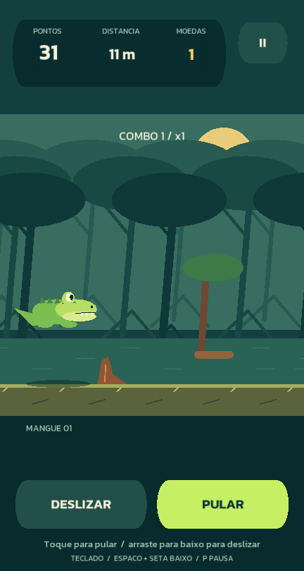

# JacaRun — protótipo visual 0.2

O aplicativo em `Source/` apresenta o mesmo `GameManager`, `Player`, `Level` e `Profile` da interface de terminal. Não existem regras de corrida separadas por plataforma. A cena cuida de desenho, input, menus e ciclo de vida; os diretórios nativos inicializam a aplicação e empacotam os recursos.



## Estado desta entrega

- Janela vertical de referência 480 × 900, mangue com parallax e personagem desenhados com `DrawNode`.
- Corrida contínua, pulo, deslize, obstáculos, coletáveis, power-ups e combos ligados ao núcleo.
- Menu, placar, pausa, resultado, reinício e loja de quatro aparências; acessórios equipados aparecem no jacaré.
- Botões de toque, gestos e teclado. O aplicativo pausa ao ir para segundo plano e pede retomada explícita.
- Save no diretório gravável da plataforma. Arquivo inválido é preservado; o jogo permite uma sessão sem gravar por cima dele.
- Bootstrap Windows e Android e arquivos de entrada iOS/macOS derivados do template oficial.

**Arte, ícones nativos e balanceamento são provisórios.** Não há áudio, anúncios, consentimento, telemetria, tutorial guiado, backend ou assinatura de produção. O empacotamento ainda inclui dependências padrão do módulo Java do Axmol; auditar e reduzir o inventário antes da publicação.

## Windows

Instale Git e Visual Studio com C++ desktop, SDK Windows e CMake. Na raiz:

```powershell
powershell -NoProfile -ExecutionPolicy Bypass -File .\build-visual.ps1 -Run
powershell -NoProfile -ExecutionPolicy Bypass -File .\build-visual.ps1 -Smoke
```

O setup não altera PATH nem AX_ROOT permanentemente. O primeiro build precisa de rede para baixar a engine e dependências. A política de scripts é definida apenas para o processo. Builds posteriores podem usar `-SkipSetup`. `-Configuration Release` compila uma versão otimizada, mas não significa aprovação para distribuição.

O teste de interface é exclusivo de Debug e usa `JACARUN_VISUAL_SMOKE`, definido automaticamente pelo script, com perfil isolado. Ele verifica:

1. Menu renderizado.
2. Botão de pulo acionado por evento de toque e passagem por raiz.
3. Gesto para baixo e passagem sob galho.
4. Coleta de moeda e alimento.
5. Pausa por ciclo de vida sem avançar a distância, e retomada por toque.
6. Colisão e game-over.
7. Save/releitura e crédito único de moedas.
8. Reinício por toque, preservando o saldo e zerando a distância.

O teste captura menu, salto, pausa e resultado, e grava `result.txt` em `output/visual-smoke-DATA-HORA`. Não substitui testes manuais de jogabilidade, multi-toque, recortes de tela e aparelhos físicos.

Para testar o núcleo sem baixar a engine:

```powershell
cmake -S . -B build -A x64
cmake --build build --config Debug
ctest --test-dir build -C Debug --output-on-failure
```

Execute em um Developer PowerShell, com CMake no PATH. O projeto raiz também gera `jacarun_cli`. Os 14 grupos existentes incluem 100 percursos procedurais.

## Android de desenvolvimento

Ferramentas desta prova: JDK 17+ (validado com JBR 21), SDK/platform 36, build-tools 36.0.0, NDK r27c (27.2.12479018), CMake 4.2+ e Ninja 1.10+. O projeto usa Gradle 9.2.1, AGP 8.11.1, API mínima 23 e apenas `arm64-v8a`.

Na raiz:

```powershell
powershell -NoProfile -ExecutionPolicy Bypass -File .\build-android.ps1
```

O script procura as instalações convencionais. É possível informar `-AndroidSdk`, `-AndroidNdk` e `-JavaHome`. As dependências Gradle ficam em `.deps/gradle`. O helper cria uma vista local dos componentes já instalados em `.deps/android-sdk` e `local.properties`, ambos ignorados pelo Git. Ele não instala SDKs nem aceita licenças; componentes ausentes devem ser preparados no Android Studio.

Saída: `visual/proj.android/app/build/outputs/apk/debug/JacaRun-debug.apk`. O build foi concluído em 24/09/2026 e uma cópia está em `output/JacaRun-debug.apk`. É um APK de desenvolvimento; não é AAB de loja, não tem assinatura de produção e não deve ser enviado à Play Console. Assinatura Debug, manifesto, arquitetura e alinhamento ZIP/ELF de 16 KB foram inspecionados; execução física continua pendente. Veja o [registro de validação](../docs/VALIDACAO_VISUAL.md).

Para instalar em um Android próprio conectado e autorizado para depuração:

```powershell
adb devices
adb install -r .\visual\proj.android\app\build\outputs\apk\debug\JacaRun-debug.apk
```

A instalação/abertura em aparelho precisa ser registrada separadamente da compilação. Não usar `-r` sobre uma versão com progresso importante sem backup/teste de compatibilidade.

## iOS

Os arquivos `proj.ios_mac/` são a base do template, com orientação vertical. Não foi feita compilação ou instalação iOS neste ambiente Windows. Em um Mac será necessário preparar a mesma revisão Axmol, ferramentas Apple e gerar o projeto Xcode pelo build oficial da engine. Validar em iPhone, configurar equipe/assinatura e revisar identificador antes do TestFlight.

O identificador provisório é `com.mgreboucas.jacarun` nas duas plataformas. Não foi verificada sua disponibilidade nas lojas.

## Comportamento e limites

- A simulação limita um frame a 100 ms para evitar saltos após travamentos; em dispositivo lento isso reduz o ritmo. Medir desempenho e ajustar antes de produção.
- O layout usa `SHOW_ALL` e margens da safe area; proporções diferentes podem gerar faixas. Testar notch, navegação por gestos, fontes e aparelhos estreitos.
- Colisões continuam sendo as regras pontuais do protótipo. O desenho usa o ponto de contato do focinho como referência; ajustar sensação de contato e caixas visuais após testes humanos.
- Moedas de uma corrida são creditadas ao perder ou encerrar pelo menu. Segundo plano pausa e salva o perfil já consolidado, mas não restaura uma corrida se o sistema encerrar o processo.
- O save visual é separado do terminal. Migração, recuperação guiada, nuvem e proteção contra adulteração ainda não foram implementadas.
- A suíte visual percorre um cenário determinista. Ela não atesta retenção, duração de bateria, sessões de 15 minutos ou prontidão para publicidade.
- Houve aviso de bibliotecas de runtime diferentes no primeiro link Debug do Windows e avisos internos do Axmol/NDK no Android. As verificações de execução e a auditoria de dependências continuam obrigatórias para produção.

## Dependências e licenças

| Componente | Revisão/origem | Licença |
| --- | --- | --- |
| Axmol + template | [v2.11.4](https://github.com/axmolengine/axmol/tree/b14941e6f50a0ce12489bd8f57041e093fb58819) | [MIT](licenses/Axmol-MIT.txt) |
| Compilador de shaders | [axslcc 1.14.0](https://github.com/axmolengine/axslcc/releases/tag/v1.14.0) | Ferramenta local da engine; não incluída no jogo |
| Kanit Regular/SemiBold | [Google Fonts / Kanit](https://github.com/google/fonts/tree/main/ofl/kanit) | [SIL OFL 1.1](Content/fonts/OFL.txt) |
| Gradle wrapper | 9.2.1, template oficial | [Apache 2.0 e avisos](licenses/Gradle-Apache-2.0.txt) |
| Cenário e jacaré | Geometria em `MainScene.cpp` | Código deste projeto; arte provisória |

O bootstrap valida o commit da engine e o SHA256 do pacote Windows do axslcc. As fontes são versionadas no repositório. Os ícones e a launch screen originais do template devem ser substituídos pela identidade final. As dependências transitivas da engine têm licenças próprias em `.deps/axmol/3rdparty`; concluir inventário/avisos de distribuição antes de publicar.

Progresso e critérios de conclusão: [cronograma](../CRONOGRAMA_PRODUCAO.md).
